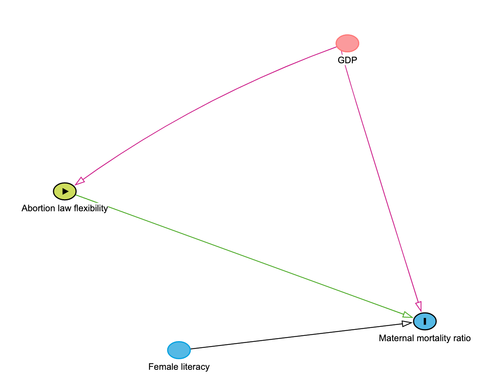

```{r setup, include=FALSE}
knitr::opts_chunk$set(echo = TRUE)

library(dagitty)
library(ggdag)
```


\newcommand{\indep}{\perp \!\!\! \perp}

Word count: app. 4637 words

## Background

Abortion law and the negative consequences of the lack of safe abortions are highly contentious policy issues that have been making headlines this year. Further, the [Sustainable Development Goal indicator 3.1](https://www.who.int/data/gho/indicator-metadata-registry/imr-details/26) of the United Nations to reduce Maternal Death to less than 70 per 100,000 live births by 2030 relies on access to safe and legal abortions. In the paper we are analysing, the authors are testing whether and, if so, to what extent abortion law as a proxy for access to safe abortions causally affects maternal mortality rates in over 160 countries around the globe. Establishing a causal relation could strengthen the implementation of abortion liberalisation policy. This is especially needed in a time where several states already withdrew or are withdrawing access to safe abortions on many grounds, such as [Poland](https://www.amnesty.org/en/latest/news/2021/10/poland-a-year-on-abortion-ruling-harms-women/) and the [USA](https://www.euronews.com/2022/05/03/us-supreme-court-moving-to-overturn-key-abortion-rights-law-says-leaked-report). Conversly, some other countries, for instance, [France](https://www.hrw.org/news/2022/03/01/france-expands-abortion-access-two-key-moves) are planning to expand abortion rights in 2022. So does abortion law flexibility cause maternal mortality? We will be taking a close critical look at a paper that tries to establish exactly that and also run our own data analysis to address this question.

## Description of the original paper

In "Abortion laws reform may reduce maternal mortality: an ecological study in 162 countries," @Latt2019 present the results of a study that aims to assess whether maternal mortality is affected by the flexibility of abortion laws. Abortion law flexibility was measured as a sum of the number of reasons for which abortion is legally allowed (ranging from 0 to 7) and was included in models as both an ordinal variable and a binary variable (inflexible vs. flexible abortion laws). Abortion laws were considered inflexible if there were less than 3 legal grounds for abortion. Maternal mortality ratio (MMR) was measured as the number of maternal deaths per 100,000 live births. Authors used fixed effects linear regression models to estimate the relationship between abortion law flexibility and MMR, while controlling for GDP per capita, country variability and time. Additional analysis included female primary education completion as a potential control variable that was not included in the main model as it had over 50% of missing data; however, results did not significantly change. Results indicated that maternal deaths reduce by 45 per 100,000 live births (95% CI: -64, -26) with flexible abortion laws. The authors conclude that abortion law reform in countries with inflexible abortion laws may reduce maternal mortality.    


##  Methodology

### Theorethical estimands

Theoretical estimand is a key part of a research question, as it describes the quantity of interest independently of statistical models and clearly describes the research goal [@Lundberg2021]. In the current paper, the theorethical estimand was not specifically stated; however, we tried to deduce the desired estimand from the research goal and the estimation strategy authors used.

The authors state that they aim to “estimate the association between the flexibility of abortion laws and maternal mortality at a country level [between 1985 and 2013]” [@Latt2019, pg. 2]. Furthermore, they estimated the model using linear regression, and the quantity they have estimated was the regression coefficient of MMR on the abortion law flexibility. Therefore, we believe that the authors wanted to assess the average treatment effect (ATE), that is, the difference in the number of maternal deaths that would occur within a country if abortion law was flexible versus inflexible:

$$
ATE = \frac{1}{n}\sum_{i=1}^{n}(MMR_i^1 - MMR_i^0) = \frac{1}{n}\sum_{i=1}^{n}\Delta MMR_i = \mathbb{E} [\Delta MMR]
$$

This estimand looks at counterfactual outcomes for all countries, regardless of whether or not a particular country would in reality receive the treatment. Country $i$'s MMR when abortion laws are flexible is denoted as $MMR_i^{(L=1)}$ or shortly $MMR_i^{(1)}$, and as $MMR_i^{(L=0)}$ or $MMR_i^{(0)}$ when abortion laws are inflexible. Individual causal effect for the country $i$ is then the difference between mortality when abortion laws are flexible vs. when they are inflexible, or $ΔMMR_i = MMR_i^{(1)} - MMR_i^{(0)}$. Individual effects averaged across all of the countries in the world would then give the wanted causal quantity. This is equal to the expectation of the effect of flexible abortion laws on MMR of a randomly selected country. 

As ATE reflects the effect of the treatment for the entire study population, it can be particularly useful for scoping the benefit of population-wide policies. However, as there will be inevitable self-selection to treatment in case of abortion policies -- some countries will choose to have more flexible laws and some will choose less flexible laws -- there are other estimands that could potentially be interesting for researchers in this particular case.

In fact, one interpretation of the results that authors give is that "it is possible that maternal mortality would reduce in [countries with low abortion flexibility scores] if legal, safe abortion was more readily available" [@Lundberg2021, pg. 6, para. 2]. This would indicate that they might actually be interested in the ATU - the average effect of the treatment on the untreated, that is, for the population of units that did not receive the treatment:

$$
ATU = \mathbb{E}[MMR^{(1)} - MMR^{(0)} \mid L = 0]
$$

ATU shows how the outcome would differ if untreated units were actually treated, in other words, the effect of expanding the treatment. This could potentially be the most useful estimand in this study, as it could be used in considering the expansion of a medical practice to units that were previously untreated [@greifer2021].  

Another potentially interesting estimand is the ATT, that is, the effect of the treatment for the population of units that actually received the treatment:

$$
ATT = \mathbb{E}[MMR^{(1)} - MMR^{(0)} \mid L = 1]
$$

ATT shows how the outcome would differ if treated units were actually not treated, in other words, the effect of the withholding the treatment from the ones who would otherwise receive it [@greifer2021]. In light of recent policy changes and reductions of abortion flexibility laws in the USA, ATT could be particularly relevant.

In an ideal (in terms of causal identification) scenario -- randomised control trials (RCTs) -- all three estimands (ATE, ATU, ATT) will be the same because we assume that:

* The baseline of the treated group is equal to the baseline of the untreated group, that is, countries that have flexible abortion laws would do *as bad* (in terms of MMR) as countries that have inflexible abortion laws, if they didn't have flexible abortion laws:

$$
\mathbb{E}[MMR^{0} \mid L = 1] = \mathbb{E}[MMR^{0} \mid L = 0]
$$

* The treatment effect will not be different in the treated and the untreated group, that is, countries that have inflexible abortion laws would do *as good* as countries with flexible abortion laws, if they made the laws more flexible:

$$
\mathbb{E}[MMR^{1} \mid L = 1] = \mathbb{E}[MMR^{1} \mid L = 0]
$$
These assumptions are commonly violated in observational studies, as we will show in the next section. Therefore it is to be expected that the three estimands (ATE, ATU, ATT) would be different in the current study. 

### Identification

For each country $i$ it is not possible to observe both potential outcomes, so a theoretical estimand is not an empirical quantity. Emprirical estimand is a translation of the theoretical, unobserved quantity, into observable data. This link is often formalised using Directed Acyclic Graphs (DAGs) that formally state model assumptions under which a theorethical estimand can be calculated [@Lundberg2021].

The current paper proposes that flexibility of abortion laws causes maternal mortality, and that GDP and female primary education completion are confounders of this relationship -- that is, they cause both whether or not a country will have flexible abortion laws and how big MMR will be. The authors also propose that the causal mechanism by which this relationship comes about is that the women in countries where restrictive laws are in place are less able (or unable) to access reproductive health care and safe abortion services, which increases the proportion of unsafe abortions, and in turn, maternal deaths. The model can be seen in the figure below:

<center>


</center>

This model has several practical implications:

* The effect that we are trying to estimate, the effect of abortion law on MMR, has 2 "paths": Law &rarr; Access to safe abortion &rarr; MMR and Law &rarr; Access to safe abortion &rarr; Number of safe abortion &rarr; MMR;
* Even though Access to safe abortion and Number of safe abortions are unmeasured, the relationship between Law and MMR can be estimated (but we won't know how much of that relationship is due to the Number of unsafe abortions); 
* Female primary education completion and GDP confound the Law &rarr; MMR relationship;
* Because Female primary education and GDP are measured, then $MMR^{(1)}, MMR^{(0)} \indep Law \mid Female \ primary \ education, GDP$.

However, there are several potential identification issues that could influence the possibility to estimate the effect of abortion law flexibility on MMR, namely: unmeasured confounding and (non-random) data missingness. These are discussed in more detail below.

**Unmeasured confounding**

What makes the estimation of ATE plausible is the “uncoupling” or *d-separation* of assignment of units of analysis (in this case, countries) into treatment and control conditions. In randomized trials, this is achieved by randomly assigning treatment to unit analysis (Figure 2a). Randomization would allow the causal effect of Law on MMR to be estimated because it:

* Identifies the effect of Abortion law on MMR; and
* Generates approximate balance in counfounders, even if a counfounder is unobserved;

Conditioning on confounders is still (statistically) desirable, as it will increase the precision of the effect estimate.

```{r, echo=FALSE,out.width="49%",out.height="49%",fig.show='hold', fig.align='center', fig.cap="Figure 2. a) Randomisation removes inbound connections from confounders to treatment, b) Without controling for all counfounders, the causal effect can't be estimated"}

knitr::include_graphics(c("Figures/dag2a.png","Figures/dag2b.png"))
```

However, in observational studies, the causal effect is identified only when we control for all confounders. If there is unobserved confounding (Figure2b), the causal effect can't be identified as:

$$
MMR^{(1)}, MMR^{(0)} \indep Law \mid Female \ primary \ education, GDP, Unmeasured \ confounders
$$ 

Given that *unmeasured confounding* is a crucial issue in effect identification, we have considered possible omitted variables and their role in the original model:

* Health expenditure: health expenditure likely determines the access to safe abortions and women’s trust in medical institutions. The original paper found that GDP and health expenditure are so closely related that they used GDP as a proxy. We will keep this assumption. 

* Religious views in society and level of secularism: The power of religious institutions and the views they hold in regard to the acceptability of abortion is likely to influence the level of maternal mortality and the flexibility of abortion law. If, for instance, a Christian Catholic institution has a lot of power in society and is very traditional, this will likely influence the flexibility of the law but also the individual’s choice whether to get a clandestine abortion outside of the health system or whether she will even have the possibility to acquire a safe abortion in a health institution. However, this confounder would be extremely difficult to measure as there is no systematic recording of religious power and the views different institutions hold for all the studied countries.

* Party in power politically: The political convictions and policies of political parties in power most likely will influence the abortion law. However, it is unlikely that it will directly cause mortality. Therefore, it is not a confounder in this model.

* State of human rights and gender equality: State of human rights and gender equality in a country could influence the abortion law flexibility and female primary education completion. However, we think it is unlikely that they will impact MMR; therefore, it would not be necessary to control for them, as long as female primary education is controlled for.

To check the robustness of the findings authors could have examined how big the unobserved confounding would have to be to cancel the estimated causal effect. Sensitivity analysis has 2 essential parts to it: 1) describing the type of unobserved confounders such as religious institutions, contraceptive prevalence, fertility rate, 2) describing the plausibility that problematic confounding might exist based on research design, expert knowledge and data-generating process.
  
Generally, sensitivity analysis is still underutilized in social science and policy research papers [@cinelli2020making, p. 40]. However, it is a very useful tool to test robustness of findings, i.e. how sensitive my effects and effect sizes are to other variables that influence the treatment or outcome studied. Therefore, we are proposing to add a sensitivity analysis to the research design and also apply it in the second part of our report. This method gives us two insights: 1) the robustness value: how robust the coefficient is to confounders influencing treatment and outcome and 2) the proportion of the outcome uniquely explained by the treatment and how strong a confounder would have to be to eliminate the effect of the treatment [@cinelli2020making, pp.40/41].

**Missing data**

(Non-random) Data missingness is also a factor that can affect the possibility of accurately identifying causal effects [@HernanSelection]. Because restricting the analysis on countries where data are complete would bias it, the authors still include countries with missing data on female literacy, another possible confounder [@Latt2019, p. 5]. However, female primary completion is only available for 50 percent of countries and female literacy only for 10 percent. This missingness of data could introduce selection bias to the specific analysis the authors did in the original paper. 

Comparing the rate of MMR and flexibility score for countries with recorded female primary completion vs countries without recorded female primary completion levels, we could check whether there is a selection bias and then generalization of effects of this model would not be possible. If we suppose that female literacy is a collider and a confounder, we cannot condition on it without creating selection bias [@elwert2014endogenous, p.38]. As this done in the current paper, we would have to select strategies to correct this. Otherwise, it would stay d-connected, so statistically dependent. 

As the likely selection bias in this study cannot be avoided due to the limitations on data availability, it needs to be corrected if possible. In the analysis this could be achieved through generalization of inverse probability weighting [@HernanSelection, p. 7]. For this, however we would need to categorize developing countries in one group where some have recorded female literacy which then gets multiplied by the number of countries not considered due to missing data. Inverse probability weighting would work as the score for female literacy is not zero for the countries where it is not recorded.  However, a lot of assumptions would need to be made to apply this method. The assumption that the *filler-country* would be close enough to the *unobserved countries* is by nature untestable and therefore it is a strong assumption.


**Further association issues**

We see issues with potential interconnectedness and association of female literacy with abortion laws and access to abortion. If there is no school that can teach women how to read most likely there is no clinic that can perform a safe abortion, further women are unlikely to be informed about such services. While the issue of women’s information is taken up in the original paper and the lack of knowledge about abortion services even stays a problem for countries with high flexibility scores, low female primary completion here used as a better recorded proxy for female literacy is likely to cause access to abortion. So, it is a post-treatment confounder that potentially influences the outcome of MMR and abortion laws or the original variable of interest - access to safe abortions - it is a proxy for. The exact path between those variables should be analysed. The original paper suggested 2 models for this:

```{r, echo=FALSE,out.width="49%",out.height="49%",fig.show='hold', fig.align='center', fig.cap="Figure 3. a) Model 1 includes all the countries and no female literacy proxy , b) Model2: Model including female literacy as proxy"}

knitr::include_graphics(c("Figures/Dag_model1.png","Figures/Dag_model2.png"))
```


However, it is also possible that female literacy has no effect on abortion law and actually only has an effect on the outcome, MMR. MMR is a common effect of female literacy and flexibility score (abortion laws). Then instead of being a causal effect of abortion law, female primary completion would be an associative risk factor[@HernanSelection, p.3]. In this case the only connection would be if we conditioned on MMR we would create a spurious relation however the effect of literacy and law on each other would be zero. Yet, we do not condition on the outcome hence no spurious relationship should be created. 

```{r, echo=FALSE,out.width="49%",out.height="49%", fig.align='center', fig.cap="Figure 4.:Female literacy's effect on Maternal mortality ratio"}


```

However, it is difficult to disentangle the relationship as lower female literacy will also lower access to safe abortions regardless of the flexibility of the law, as women are likely less informed about their health care options which in turn increases female mortality.

Testing for those different possible scenarios would be possible with sensitivity analysis or inverse probability weighting. We would need to control for the differences in the sets of considered countries (female lit = 1, recorded) and not considered countries (female literacy = 0, not-recorded) and see what other differences there are or trends in the groups other than female literacy being observed. While the authors drew two models they did not make this clear comparison in the paper. This additional analysis would help us to gain insight into whether recorded primary completion influences female mortality and to what extent. Further, it should be checked whether primary completion is a function of the state of human rights and GDP. The general state of human rights and equality could also influence abortion law and thus should be studied in order to make policy recommendations. However, a coded human rights and equality score that would be usable for causal analysis would need to be found. The [IDEA democracy indices](https://www.idea.int/data-tools/tools/global-state-democracy-indices) could be considered as a proxy for this.

A possible model for future research could be:

```{r, echo=FALSE,out.width="60%",out.height="60%", fig.align='center', fig.cap="Figure 5.: Suggested causal model for future research"}


```

### Empirical estimation

To estimate the effects of Abortion law flexibility on MMR, the authors of the paper fitted a fixed effects multiple regression model, in which they control for GDP, time, and countries, while trying to estimate the regression slope of flexible abortion law as the causal effect that is being studied:

$$
MMR=\beta_0 + \beta_1 L+\beta_2 GDP +\beta_3 P+ \beta_4 C
$$
In the formula, P and C respectively account for 3 year periods and the country specific effects. 

This approach has been called "the workhorse model" used by researchers to estimate causal effects [@Aronov2016]. What fixed effects models do is that they remove all the unmeasured but group-specific confounding effects related to the unit that is being controlled. Controlling for unobserved counfounding related to countries and time is a common approach in studies such as these. However, this approach can have subtle consequences that limit the generalizibility of the findings.

@Aronov2016 showed that multiple regression estimates are actually weighted averages of unit-specific contributions. In cases when treatment effects are heterogeneous, for example if the effect of abortion law flexibility is not the same for every country in the current paper, $\beta_L$ will not reflect ATE. Rather, it will be more strongly influenced by units that have more variability: many observations, large variations in abortion law flexibility and MMR, and that are hard to predict from country and time fixed effects and other controls (GDP, female primary education completion). This means that the estimated effect will be actually valid for a *sub-sample* of the population that is being studied. @Aronov2016 suggest that the *effective* sample, the sub-sample that has the strongest weights in the analysis should be reported explicitly so that it is more clear to which cases the effects generalise.    

Even by controlling for the heterogeneous effects of treatment, there is still the lack of counterfactual problem that can become an issue when estimating causal effects in observational studies (because it is impossible to observe participants under both treatment and non-treatment). The G-separation method proposed by @snowden2011implementation addresses this issue by generating counterfactual outcomes for each observation and providing a full dataset "free of confounding under causal assumptions", which allows to isolate easily isolate causal effects (direct or heterogeneous)[@snowden2011implementation].

## Analysis
Our empirical exploration had two main objectives:

1. to reproduce the methodology of the original paper with updated data on the same covariates and outcome,

2. to compare the result thus obtained with some other methods that address heterogeneity of effects, missingness of confounders and unmeasured confounders. 

**Updated datasets**

Although the datasets used in the original paper were hosted in public websites, the currently available version is not exactly the same. They were both hosted in interactive webpages, so we couldn't access the aggregated and historical data for both abortion policies and maternal mortality rates between 1985-2013. Despite these restrictions, we collected data on all the relevant variables from 2000 to 2017. The maternal mortality data was accessed in the World Bank Data repository [@MMR], and the global abortion policies were found in the UN Department for Economic and Social Affairs archive [@WorldAbortionPolicies].

As in the original dataset, the Maternal mortality ratio (MMR) was measured as the number of maternal deaths per 100,000 live births; legal grounds for abortion where coded as binary variables ("1" for countries that legally allow for abortion on that ground; "0" for those that don't), and the flexibility score for abortion policies was calculated by adding the legal grounds together. 

Unlike the authors, our binary flexibility of abortion policies variable is slightly more stringent: since the median of the abortion grounds calculated every 3 years is approximately 4 in average, we determined that abortion laws are inflexible if countries allow for less than 4 legal grounds for abortion.

**Regression ATE**

In the first part of our exploration, we followed the methodology of the original paper and used fixed effects linear regression models to estimate the relationship between abortion law flexibility and MMR. We controlled for GDP per capita, time in three-year intervals, and country-specific effects through a factor country-name variable. According to our results, flexible abortion laws reduce maternal deaths by 57 per 100.000 live births. This result is close enough to the original result, which found that maternal deaths reduce by 45 per 100,000 live births (95% CI: -64, -26) with flexible abortion laws. 
We also conducted added "female primary education completion" as a control variable, and found very similar result: the effect of abortion law flexibility on maternal mortality appears to be a reduction in the mortality rate of 53 deaths per 100.000 live births.

**Treating the heterogeinity of effects**

Following the approach of @Aronov2016, we have reproduced the weights that multiple regression analysis use to calculate the effects by: 

1. regressing the GDP and the fixed effects for countries and time period on the abortion law flexibility score (measured as a score from 0 to 7); 
2. squaring the weights.

As expected, our analysis showed that countries have different weights in the estimated causal effect. The nominal sample, the full population of the countries that have data for both the treatment and the outcome, is shown on Figure 6a and it includes almost all countries in the world. However, the effective sample, defined here as the countries that contribute over half (51%) of the weight used to construct the estimate of the abortion law flexibility on MMR, consists of only 14 countries (Figure 6b).

```{r, echo=FALSE,out.width="49%",out.height="49%",fig.show='hold', fig.align='center', fig.cap="Figure 6. a) Nominal sample - all the countries in the analysis b) Effective sample - countries that contribute over 51% of the effect of abortion law flexibility on MMR"}

knitr::include_graphics(c("Figures/full_sample.png","Figures/effective_sample.png"))
```


As expected, countries with more data and higher variability in abortion law flexibility and MMR contribute more to the effect, as can be seen from  *Figure 7* below.

```{r, echo=FALSE,out.width="49%",out.height="49%",fig.show='hold', fig.align='center', fig.cap="Figure 7. a) Countries that contribute the most to the effect of abortion law flexibility on MMR vs. b) Countries that contribute the least"}

knitr::include_graphics(c("Figures/most.png","Figures/least.png"))
```


**Treating confounders' missingness through G-separation**

G-separation, as proposed by @snowden2011implementation, starts with fitting traditional regression of the outcome on the treatment and relevant covariates. It then uses it to predict counterfactual outcomes for all the observations under both treatment settings (L=1 for flexible abortion laws and L=0 if not). More specifically, by plugging both treatment regimes in the regression fit, two predicted outcomes are obtained: $MMR^{(L=0)}=MMR^{0}$ for the unexposed and $MMR^{(L=1)}=MMR^{1}$ for the exposed. Both outcomes are then used to calculate the average $MMR^{1}-MMR^{0}$, which corresponds to the ATE. Furthermore, G-separation allows for the calculation of both ATT and ATU by restricting the ATE estimation to the treated and the untreated respectively[@wang2017g]. 

After following this metodology, we got an $ATE=-56,9$, which is roughly the same as the result of the regression model. This is not surprising since both models estimated the effect as if it where identical across all strata of covariates because no covariate interactions were specified, which would account for heterogeneous effects.

We then calculated the treatment effects on the treated and the untreated and got the following results: $ATT=-56.86$ and $ATU=-2.16e^{-12}$, which means that ATT and the ATE are almost the same and the ATU is almost negligible. 

The latter would mean that the potential impact of flexibility on abortion policies on MMR among those countries that have very stringent laws is almost non-existent, contradicting one of the central assumptions of the original paper. However, such a conclusion is not completely justified. On the contrary, this results comes with the need to revise the central assumptions under which the ATT and ATU can be calculated with G-separation. As explained by [@wang2017g], the computation of ATT and ATU also calls for consistency. This is, it requires assuming that the observed outcomes don't depend on the means by which the treatment was assigned. As @cole2009consistency, this assumption is very hard to fullfil in observational studies (because there is no way to manipulate the treatment). In the specific case of our study, there are aspects of the way the laws are adopted (judicial review, constitutional mandate, etc.) that might affect the outcome. 

**Using sensitivity analysis as an approach to unobserved confounding**

Finally, we conducted a sensitivity analysis to estimate the robustness of the effect of interest against unobserved counfounders in our model [@cinelli2020making]. These potential confounders are not usually considered in  traditional regression estimates to avoid bias, but they might substantively change our conclusions. 

We then run the sensitivity analysis proposed by @cinelli2020making using "female primary completion levels" and gdp as benchmark covariates for two models: 
1. The one used by the original paper (and used by us for the g-separation analysis).
2. A different regression model including primary completion levels as confounder. 

The robustness value of the sensitivity analysis allows us to quantify the amount of residual variance of both the treatment and the outcome that unobserved confounders must explain in order to remove the observed effect. In the first model, the robustness value was 16%, while for the second one it was 21%. This means that in the second model the unobserved confounders need to be "stronger" to wash away the effect of flexibility laws on MMR.

But how strong must they be to completely remove the effect in both models? The following countour plots show that, while gdp doesn't have a strong effect on MMR, in the second model a counfounder three times as strong as primary completion would remove the causal effect of interest. This means that even if the effect of primary completion levels appears to be small, other strong confounders as the ones listed above might easily reduce the effect of interest of our study.


```{r, echo=FALSE,out.width="49%",out.height="49%",fig.show='hold', fig.align='center', fig.cap="Figure 8. a) Countour plot for the sensitivity analysis of model 2 using primary completion level as benchmark confounder vs. b) Countour plot for the sensitivity analysis of model 1 using gdp as benchmark confounder"}

knitr::include_graphics(c("Figures/primary.sensitivity.png","Figures/primary.sensitivity.png"))
```


## Conclusion 
The policy conclusion the original paper draws is justified. However, we could expand upon the methodology to get a more precise result and consider possible models as the limitation of the approach is not sufficiently justified in their paper. There are several ways to amend or extend the original research design. We presented suggestions in the theoretical part of our report like applying sensitivity analysis and accounting for the heterogeneity of effects. We generated partial insights with our own data analysis. The causal relation between abortion law and maternal mortality ratios could be established. However, the strength of the effect remains to be studied with an extended methodological toolbox.


## Contributions

Our analysis can be found in the following github link: [Abortion Laws Repository](https://github.com/aduarte56/AbortionLaws)

We worked together as a team on all parts of the paper and engaged with our colleagues' ideas throughout. Each of us took the lead on parts of the report as detailed below:

* Helena Bakic (bakic.helena@outlook.com): Empirical estimation, Identification, Heterogeinity of effects, Analysis
* Anna-Lisa Wirth (213286@mds.hertie-schoo.org): Background, Unmeasured Confounding, Missing Data, Sensitivity Analysis, Analysis and Conclusion 
* Ángela Duarte Pardo: Data Cleaning, G-separation, Methodology, Modelling and Analysis

## References


